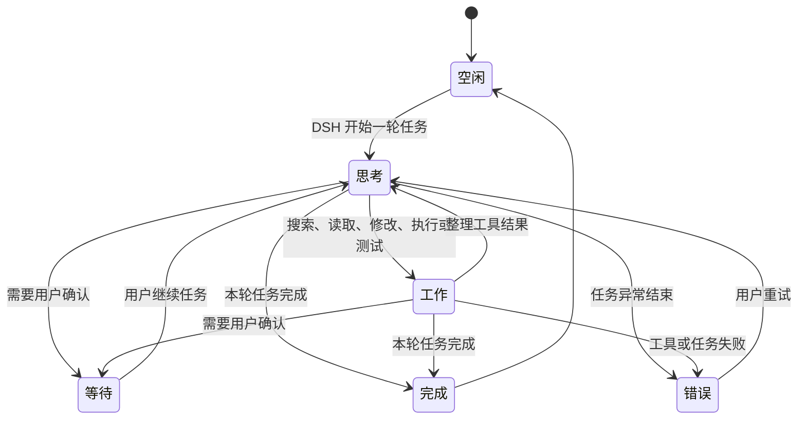

<div align="center">

# DSH 大肥鱼 🐋

**住在 macOS 桌面上、由 DeepSeek Harness 真实工作状态驱动的 Agent 伴侣。**

入口属于 DSH，生命周期属于 DSH，显示层属于桌面。

> ## ⚠️ 作者与版本声明
>
> - **原作者**：本项目的全部原始代码与视觉素材版权归 **QCYTSN**（https://github.com/QCYTSN/dsh-dafeiyu）所有，遵循 MIT 许可证（视觉素材除外，见 [ASSET_LICENSE.md](ASSET_LICENSE.md)）。
> - **本重构版**：`0.2.0` 是社区在**原作者基础上用 Swift + AppKit 重写的 macOS 原生重构版**——用 Swift 桌面助手（`DafeiyuHelper.app`）替代原版 Python/Qt 助手，实现「透明桌宠窗口 + 原版全部桌面交互」。
> - **平台限制**：**仅支持 Apple Silicon（arm64）Mac**（M1/M2/M3/M4 系列），不支持 Intel Mac、Windows、Linux。
> - **功能对比**：本重构版对齐了原版 v0.1.5 的全部桌面特性（状态动画、程序化动效、点击/双击互动、右键菜单、完成音效、系统通知、微动画频率、crossfade 等），具体对照见 [CHANGELOG.md](CHANGELOG.md) 0.2.0 一节的「Added/Changed」以及下方「与原版功能对比」小节。

[English](README_EN.md) · [npm](https://www.npmjs.com/package/dsh-dafeiyu) · [下载最新版本](https://github.com/QCYTSN/dsh-dafeiyu/releases) · [更新日志](CHANGELOG.md) · [更新与回退](docs/UPDATING.md) · [验收记录](docs/ACCEPTANCE.md)

[](https://www.npmjs.com/package/dsh-dafeiyu) · [](https://github.com/QCYTSN/dsh-dafeiyu/releases)

</div>


DSH 大肥鱼不是一个需要单独启动的桌宠应用。它由 DSH 插件启用，跟随 DSH
一起启动和退出，并以透明、无边框、始终置顶的原生窗口显示在桌面上。即使切换到
VS Code、浏览器或文件管理器，也能知道 DSH 当前在思考、修改、测试、等待还是已经完成。

> 当前版本：`0.2.0` · macOS (Apple Silicon) · 首版

## 关注最新进展

- 最新版本永远以 [npm `latest`](https://www.npmjs.com/package/dsh-dafeiyu) 和 [GitHub Releases](https://github.com/QCYTSN/dsh-dafeiyu/releases) 为准（Releases 里同时提供 `.tgz` 安装包）；顶部的版本徽章会自动更新。
- 给仓库 **Star 只是收藏，不会收到更新通知**。想第一时间知道「更新了什么」：
  1. 打开仓库点 **Watch → Custom → Releases**，只订阅 Release 通知；
  2. 或直接订阅 Releases 的 feed：<https://github.com/QCYTSN/dsh-dafeiyu/releases.atom>
- 已安装用户升级：完全退出 DSH 后执行
  ```powershell
  dsh plugin --profile web update dsh-dafeiyu
  ```
  然后重新启动 DSH 即可。

## 它有什么用？

- **离开 DSH 页面也能看到状态**：大肥鱼始终显示在 macOS 桌面最上层。
- **反馈来自真实 Agent 事件**：不会读取屏幕，也不会把你在其他软件里的操作误判为 DSH 工作。
- **展示足够但不过量的信息**：项目名、当前阶段、正在进行的步骤和真实待办进度会显示在状态卡上。
- **有生命力但不打扰**：思考、查找、修改、执行、验证、等待、完成和错误都有对应动作与自然文案。
- **没有第二套应用入口**：无需单独运行 Helper、安装 Python 或配置额外端口。

如果 DSH 没有提供待办清单，大肥鱼只显示“分析阶段”“实现阶段”“验证阶段”等可靠信息，
不会编造完成百分比。

## 状态展示

| 思考 | 工作 |
| --- | --- |
|  |  |

| 等待确认 | 完成 |
| --- | --- |
|  |  |

| 遇到问题 |
| --- |
|  |

状态大致按照下面的流程变化：



多个 DSH Session 同时运行时，默认优先展示最需要注意的顶层任务：

`等待确认 > 错误 > 工作 > 思考 > 空闲`

当有多个活动任务时，状态气泡会同时列出这些任务的状态。

## 系统要求

- **macOS 14+（Sonoma 或更新），Apple Silicon（M1/M2/M3/M4 系列）**
- **不支持 Intel Mac（x86_64）**：当前发布仅含 `darwin-arm64` Helper 二进制
- **不支持 Windows / Linux**：无桌面显示，也不提供对应 Helper
- 已安装并能正常运行的 DeepSeek Harness WebUI
- DSH CLI 中可以使用 `plugin --profile web` 命令
- npm 上的稳定版 `dsh-dafeiyu`（或抢先测试的 `dsh-dafeiyu@alpha`），或 GitHub Release 中的 `.tgz` 安装包

普通用户**不需要**安装 Xcode 命令行工具或单独运行 Helper；macOS Helper 已包含在发布包里。

当前首版的设置与桌面状态文案使用简体中文。

## 安装插件

### 1. 完全退出 DSH

先关闭 DSH Host，而不只是关闭浏览器标签页。安装或更新时不要让旧版插件继续运行。

### 2. 一行命令安装

在终端中进入你的 DSH 安装目录，例如：

```bash
cd ~/DSH
```

然后从 npm 安装稳定版：

```bash
pnpm exec dsh plugin --profile web add dsh-dafeiyu
```

如果你的系统已经能直接使用全局 `dsh` 命令，只需要：

```bash
dsh plugin --profile web add dsh-dafeiyu
```

想抢先试用新功能（`@alpha` 测试版）的用户，把命令里的包名换成 `dsh-dafeiyu@alpha` 即可。

当前支持范围是 macOS (Apple Silicon)；普通 Linux、远程 Linux 和容器不是本版本的桌面显示目标。

### 3. GitHub Release 备用安装方式

进入 [GitHub Releases](https://github.com/QCYTSN/dsh-dafeiyu/releases)，下载最新的：

```text
dsh-dafeiyu-<version>.tgz
```

不要解压这个文件。

不解压，在 DSH 目录中直接安装下载的插件包：

```bash
pnpm exec dsh plugin --profile web add "$HOME/Downloads/dsh-dafeiyu-<version>.tgz"
```

### 4. 启动 DSH

照常启动 DSH WebUI。插件默认启用，大肥鱼会由 DSH 自动拉起；不要手动打开 Helper。

### 5. 找到设置入口

在 DSH WebUI 中进入：

```text
设置 → 插件 → 插件配置 → 大肥鱼桌面伴侣
```


## 怎么使用？

安装后不需要额外操作：

1. 启动 DSH。
2. 在 DSH 中开始一个项目任务。
3. 大肥鱼根据 DSH 的真实事件切换动作和状态卡。
4. 切换到其他窗口继续工作；大肥鱼仍然保持在桌面最上层。
5. DSH Host 真正退出后，大肥鱼自动退出。

状态卡可能显示：

- 项目目录名称，例如 `dsh-dafeiyu`
- 当前阶段，例如“分析阶段”“实现阶段”“验证阶段”
- 当前待办，例如“完善项目文档”
- 真实进度，例如“已完成 3/5 步”
- 等待、完成或错误提示

大肥鱼不会监听 VS Code、浏览器或其他应用，也不会截图。只有 DSH Agent 的事件能够
改变它的工作状态。

## 可配置项目

| 设置 | 作用 |
| --- | --- |
| 启用大肥鱼 | 立即显示或关闭桌面伴侣 |
| 角色大小 | 在 70%～140% 之间调整 |
| 气泡大小 | 在 80%～120% 之间调整状态气泡，兼顾信息可读性 |
| 气泡显示 | 常驻显示、完全隐藏，或自定义哪些状态显示气泡 |
| 活跃程度 | 控制空闲时眨眼、观察等微动作频率 |
| 减少动态效果 | 减少走动、循环帧和程序化晃动 |
| 响应子 Agent | 允许子 Agent 状态参与优先级选择；默认关闭 |

设置由 DSH 保存，更新插件后通常不需要重新配置。

## 与原版（v0.1.5）功能对比

本重构版（0.2.0，Swift 原生）在原作者 v0.1.5 的基础上实现，**对齐原版桌面全部功能**：

| 能力 | 原版 v0.1.5（Qt/Python） | 本重构版 0.2.0（Swift/AppKit） |
| --- | --- | --- |
| 透明置顶桌宠窗口 | ✅ NSPanel（全空间） | ✅ NSWindow（全空间，内容驱动尺寸） |
| 状态动画 + 程序化动效 | ✅ breathe/bounce/shake 等 | ✅ 同款（CACurrentMediaTime 相位） |
| 状态切换 crossfade | ✅ 0.10s | ✅ 0.10s（表情硬切） |
| idle 微动画（activityLevel 调频） | ✅ quiet/normal/lively | ✅ 同款间隔表 |
| 点击互动（摸头/尾巴/戳） | ✅ | ✅ |
| 右键菜单（迷你 0.6~大 1.25） | ✅ | ✅（55%–140%） |
| 完成/错误音效 | ✅ 自带 wav | ✅ 原版 wav + 音量拉满 |
| 完成窗口抖动 | ✅ | ✅ |
| 系统通知横幅 | ✅ | ✅（首次授权 + 图标） |
| 拖动 + 位置持久化 | ✅ | ✅ |
| 多任务卡片 | ✅ | ✅（**增强**：只列后台会话） |
| 平台 | Windows/Linux/macOS 通用 | **仅 Apple Silicon Mac** |

**差异与取舍**：本版仅面向 Apple Silicon macOS，文件更精简；交互、表现、通知与原版对齐，并加入「只看后台会话」等易用性增强。

## 桌面互动

- **拖动**：按住大肥鱼移动位置，位置会自动保存。
- **点击互动**：点击头顶「摸摸」、右侧「摸尾巴」、身体「戳一下」，大肥鱼会做出反应并吐槽；双击摸摸头。
- **右键菜单**：大小（迷你/小/标准/大，55%–140%）、气泡大小、减少动态、打开 WebUI、本次隐藏、本次关闭。
- **完成反馈**：任务完成/出错时，桌宠轻微摇晃并播放专属提示音（可在设置中关闭）。
- **后台会话展示**：桌宠自动显示「你没在看」的后台任务状态；你正在对话的会话不会重复显示。

## 更新插件

GitHub 仓库出现新提交后，已经安装的插件**不会自动变化**。新版本发布后，完全退出
DSH，然后更新 npm 稳定版包：

```bash
cd ~/DSH
pnpm exec dsh plugin --profile web update dsh-dafeiyu
```

也可以再次执行安装命令，它会解析 npm `latest` 标签指向的新版本：

```bash
pnpm exec dsh plugin --profile web add dsh-dafeiyu
```

使用 `@alpha` 测试版的用户，把更新命令里的包名换成 `dsh-dafeiyu@alpha` 即可。

使用 GitHub Release 安装的用户，可以下载新 `.tgz` 后覆盖安装：

```bash
pnpm exec dsh plugin --profile web add "$HOME/Downloads/dsh-dafeiyu-<new-version>.tgz"
```

以上方式都会替换插件及随包携带的 macOS Helper，并保留 DSH 已保存的设置。详细
说明见 [插件更新与回退](docs/UPDATING.md)。

## 回退到旧版本

完全退出 DSH，重新安装之前保留的旧版 `.tgz`：

```bash
cd ~/DSH
pnpm exec dsh plugin --profile web add "$HOME/Downloads/dsh-dafeiyu-<old-version>.tgz"
```

## 卸载插件

完全退出 DSH 后运行：

```bash
cd ~/DSH
pnpm exec dsh plugin --profile web remove dsh-dafeiyu
```

然后重新启动 DSH。插件代码和 Helper 会从 `web` profile 中移除。DSH 可能保留一份
不会再生效的历史设置，这不会启动进程或占用额外端口。

## 常见问题

<details>
<summary><strong>安装后没有看到大肥鱼</strong></summary>

1. 确认安装使用的是 `--profile web`。
2. 完全退出并重新启动 DSH Host。
3. 进入“设置 → 插件 → 插件配置”确认“启用大肥鱼”已经勾选。
4. 确认 macOS 为 Apple Silicon（M1/M2/M3/M4），且使用的是 `darwin-arm64` 发布包。

</details>

<details>
<summary><strong>关闭了 DSH 网页，为什么大肥鱼还在？</strong></summary>

大肥鱼绑定的是 DSH Host 生命周期，而不是浏览器标签页。只要 DSH 后台仍在运行，
大肥鱼就会继续显示；真正退出 DSH Host 后它会自动关闭。

</details>

<details>
<summary><strong>为什么没有显示数字进度？</strong></summary>

只有 DSH 写入了结构化待办时，插件才能可靠计算“已完成 3/5 步”。没有真实待办数据时，
状态卡只显示当前工作阶段，避免制造虚假的百分比。

</details>

<details>
<details>
<summary><strong>任务完成/出错时没有收到系统通知</strong></summary>

大肥鱼通过 macOS 用户通知中心发送完成/错误通知。需要在 DSH 首次启动后在
**系统设置 → 隐私与安全性 → 通知** 中授权（首次收到通知时系统会弹出一次授权请求）。

如果未授权，大肥鱼会照常显示状态，只是不会弹出通知横幅；Helper 日志会在
stderr 中记录"notification permission not granted"提示。首版通过 npm 分发的裸
命令行二进制不含应用 bundle 身份，若需稳定收到横幅通知，请通过 `.app` 形式分发。

</details>

## 隐私与边界

- 不读取或保存模型 API Key
- 不截图，不读取其他窗口内容
- 不发送遥测
- 不监听键盘输入或其他应用行为
- 不新开网络端口；设置卡复用 DSH 的本地 Web 服务
- 默认只跟随最近活跃的顶层 DSH Session

## 开发与测试

```bash
pnpm install
npm test
npm run build:helper:mac
npm run test:helper:mac:headless
```

开发时可以直接运行 Helper（调试用），正式用户不应手动启动它：

```bash
swift run --package-path runtime/macos --target DafeiyuHelper -- --headless
```

## 更多文档

- [产品范围与取舍](docs/PRODUCT_SCOPE.md)
- [执行计划](docs/EXECUTION_PLAN.md)
- [兼容性验证](docs/PHASE0.md)
- [验收记录](docs/ACCEPTANCE.md)
- [更新、回退与卸载](docs/UPDATING.md)
- [维护者发布流程](docs/RELEASING.md)
- [角色视觉资产许可](ASSET_LICENSE.md)

相关项目：[QCYTSN/ds-local-pet](https://github.com/QCYTSN/ds-local-pet) 是独立桌宠版本；
本仓库是只服务于 DSH 状态的插件版本。

## License

代码采用 [MIT License](LICENSE)。角色视觉资产不适用 MIT 代码许可证，来源和使用边界
见 [ASSET_LICENSE.md](ASSET_LICENSE.md)。
