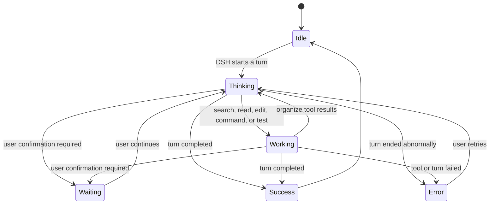

<div align="center">

# DSH BigFish 🐋

**A desktop companion that lives on macOS and reacts to real DeepSeek Harness activity.**

Enabled by DSH, owned by the DSH lifecycle, rendered on the desktop.

[中文](README.md) · [npm](https://www.npmjs.com/package/dsh-dafeiyu) · [Latest release](https://github.com/QCYTSN/dsh-dafeiyu/releases) · [Changelog](CHANGELOG.md) · [Update and rollback](docs/UPDATING.md) · [Acceptance notes](docs/ACCEPTANCE.md)

[](https://www.npmjs.com/package/dsh-dafeiyu) · [](https://github.com/QCYTSN/dsh-dafeiyu/releases)

</div>


DSH BigFish is not a standalone desktop-pet application. DSH enables the plugin, starts and
stops its native Helper, and provides the Agent events that drive it. The transparent,
frameless companion stays above other apps on the macOS desktop, so you can see whether DSH is
thinking, editing, testing, waiting, or finished while working in VS Code, a browser, or
the Finder.

> Current version: `0.2.0` · macOS (Apple Silicon) · First release

## Follow updates

- The latest version always matches npm [`latest`](https://www.npmjs.com/package/dsh-dafeiyu) and [GitHub Releases](https://github.com/QCYTSN/dsh-dafeiyu/releases) (which also carry the `.tgz` archives); the badges above update automatically.
- **Starring is just a bookmark — GitHub will not notify you of updates.** To get notified about what changed:
  1. Open the repo and choose **Watch → Custom → Releases**;
  2. or subscribe to the Releases feed: <https://github.com/QCYTSN/dsh-dafeiyu/releases.atom>
- To upgrade an installed copy: fully exit DSH, then run
  ```bash
  dsh plugin --profile web update dsh-dafeiyu
  ```
  and start DSH again.

## What is it for?

- **See DSH status away from the WebUI:** BigFish stays on top of the macOS desktop.
- **React to real Agent events:** it does not inspect the screen or mistake activity in other apps for DSH work.
- **Show useful, compact context:** the card can display the project, current phase, active step, and real todo progress.
- **Feel alive without becoming noisy:** thinking, searching, editing, commands, testing, waiting, success, and errors have distinct motion and friendly copy.
- **Avoid a second app experience:** users do not launch the Helper, install Xcode, or configure another port.

If DSH has not emitted a structured todo list, BigFish shows reliable phases such as
"Analysis," "Implementation," or "Verification" instead of inventing a percentage.

## Status previews

| Thinking | Working |
| --- | --- |
|  |  |

| Waiting for you | Complete |
| --- | --- |
|  |  |

| Needs attention |
| --- |
|  |

The high-level state flow is:



When several DSH sessions run at once, the default attention priority is:

`Waiting > Error > Working > Thinking > Idle`

When multiple tasks are active, the status bubble lists them at the same time.

## Requirements

- **macOS 14+ (Sonoma or newer), Apple Silicon (M1/M2/M3/M4 series)**
- **Intel Mac (x86_64) is not supported** — the release carries only the `darwin-arm64` Helper binary
- **Windows / Linux are not supported** — no desktop surface and no matching Helper
- A working DeepSeek Harness WebUI installation
- A DSH CLI that supports `plugin --profile web`
- the stable `dsh-dafeiyu` from npm (or `dsh-dafeiyu@alpha` to try prereleases early), or a `.tgz` archive from GitHub Releases

Regular users do **not** need Xcode command-line tools and should not launch the Helper
manually. The macOS Helper is bundled in the release archive.

The current first release uses Simplified Chinese for the settings UI and desktop status copy.

## Install

### 1. Fully exit DSH

Stop the DSH Host, not only the browser tab. An old Helper should not remain active during
installation or upgrade.

### 2. Install with one command

Open Terminal in your DSH installation directory, for example:

```bash
cd ~/DSH
```

Install the current stable release from npm:

```bash
pnpm exec dsh plugin --profile web add dsh-dafeiyu
```

If `dsh` is already available globally, the command is simply:

```bash
dsh plugin --profile web add dsh-dafeiyu
```

To try new features before they are stable, install from the `@alpha` tag instead:
`pnpm exec dsh plugin --profile web add dsh-dafeiyu@alpha`.

The current target is macOS (Apple Silicon); ordinary Linux, remote Linux, and containers
are not desktop-display targets for this release.

### 3. GitHub Release fallback

Open [GitHub Releases](https://github.com/QCYTSN/dsh-dafeiyu/releases) and download:

```text
dsh-dafeiyu-<version>.tgz
```

Do not extract it. Install the downloaded archive from the DSH directory:

```bash
pnpm exec dsh plugin --profile web add "$HOME/Downloads/dsh-dafeiyu-<version>.tgz"
```

### 4. Start DSH

Launch the DSH WebUI normally. The plugin is enabled by default, and DSH starts BigFish
automatically. Do not start the Helper yourself.

### 5. Open the settings

In the DSH WebUI, go to:

```text
Settings → Plugins → Plugin configuration → BigFish Desktop Companion
```


## How to use it

There is no separate workflow after installation:

1. Start DSH.
2. Begin a project task in DSH.
3. BigFish reacts to real DSH events and updates its animation and status card.
4. Switch to another app; BigFish remains above the desktop.
5. BigFish exits automatically when the DSH Host actually stops.

The status card can show:

- the project directory, such as `dsh-dafeiyu`
- the current phase, such as Analysis, Implementation, or Verification
- the active todo, such as "Improve project documentation"
- real progress, such as "3/5 steps complete"
- waiting, success, or error messages

BigFish does not watch VS Code, browsers, or other apps and does not take screenshots. Only
DSH Agent events can change its work state.

## Settings

| Setting | Purpose |
| --- | --- |
| Enable BigFish | Show or stop the desktop companion immediately |
| Character size | Scale the character from 70% to 140% |
| Bubble size | Scale the status bubble from 80% to 120% while keeping status text readable |
| Bubble visibility | Always show, hide completely, or choose which states show the bubble |
| Activity level | Control the frequency of idle blinks and micro-animations |
| Reduced motion | Reduce walking, looping frames, and procedural movement |
| Include subagents | Allow subagent sessions to participate in status priority; off by default |

DSH persists these settings, so a normal plugin update does not require reconfiguration.

## Desktop interactions

- **Drag:** move BigFish; its position is saved automatically.
- Click/double-click interactions and a right-click menu are not implemented in the first release and will be added in later versions.

## Update

An installed plugin does **not** change when new commits appear on GitHub. After a new version
is published, fully exit DSH and update the npm stable package:

```bash
cd ~/DSH
pnpm exec dsh plugin --profile web update dsh-dafeiyu
```

Running the install command again also resolves the newest version behind the npm `latest` tag:

```bash
pnpm exec dsh plugin --profile web add dsh-dafeiyu
```

Users who opted into `@alpha` can run the same commands with the package name `dsh-dafeiyu@alpha` instead.

Users who installed from GitHub Releases can download the new `.tgz` and install it over the
old version:

```bash
pnpm exec dsh plugin --profile web add "$HOME/Downloads/dsh-dafeiyu-<new-version>.tgz"
```

All three paths replace the plugin and bundled macOS Helper while retaining settings saved
by DSH. See [Update and rollback](docs/UPDATING.md) for details.

## Roll back

Fully exit DSH and install a previously saved release archive with the same `add` command:

```bash
cd ~/DSH
pnpm exec dsh plugin --profile web add "$HOME/Downloads/dsh-dafeiyu-<old-version>.tgz"
```

## Uninstall

Fully exit DSH, then run:

```bash
cd ~/DSH
pnpm exec dsh plugin --profile web remove dsh-dafeiyu
```

Restart DSH afterward. The plugin and Helper are removed from the `web` profile. DSH may keep
an inactive copy of historical settings; it does not start a process or open a port.

## Troubleshooting

<details>
<summary><strong>BigFish does not appear after installation</strong></summary>

1. Confirm that you installed into `--profile web`.
2. Fully stop and restart the DSH Host.
3. Open "Settings → Plugins → Plugin configuration" and confirm that BigFish is enabled.
4. Confirm macOS is Apple Silicon (M1/M2/M3/M4) and the release archive contains the `darwin-arm64` Helper.
5. Open "System Settings → Privacy & Security → Accessibility" and confirm DSH is authorized (BigFish needs always-on-top window permission).

</details>

<details>
<summary><strong>Why does BigFish remain after I close the DSH browser tab?</strong></summary>

BigFish follows the DSH Host lifecycle, not the browser tab. It remains visible while the DSH
backend is still alive and exits when the Host actually stops.

</details>

<details>
<summary><strong>Why is there no numeric progress?</strong></summary>

The plugin can calculate "3/5 steps complete" only when DSH emits a structured todo list.
Without real progress data, the card shows the current phase instead of inventing a percentage.

</details>

<details>
<summary><strong>No system notification on task completion/error</strong></summary>

BigFish sends completion and error notifications through the macOS User Notification Center.
You need to grant notification permission in **System Settings → Privacy & Security →
Notifications** on the first DSH launch (the system shows a one-time authorization prompt).

If permission is not granted, BigFish still displays status normally — it just does not show
notification banners. The Helper logs "notification permission not granted" to stderr. The
first npm-distributed release ships as a bare command-line binary without an app bundle
identity; for reliable banner notifications, a future `.app` distribution form is recommended.

</details>

## Privacy and boundaries

- Does not read or store model API keys
- Does not take screenshots or inspect other windows
- Does not send telemetry
- Does not monitor keyboard input or other app activity
- Does not open a new network port; the settings card reuses DSH's local Web service
- Follows the most recently active top-level DSH session by default

## Development and tests

```bash
pnpm install
npm test
npm run build:helper:mac
npm run test:helper:mac:headless
```

Developers can run the source Helper directly (debugging only); regular users should not:

```bash
swift run --package-path runtime/macos --target DafeiyuHelper -- --headless
```

## More documentation

- [Product scope and trade-offs](docs/PRODUCT_SCOPE.md)
- [Execution plan](docs/EXECUTION_PLAN.md)
- [Compatibility spike](docs/PHASE0.md)
- [Acceptance notes](docs/ACCEPTANCE.md)
- [Update, rollback, and uninstall](docs/UPDATING.md)
- [Maintainer release workflow](docs/RELEASING.md)
- [Character asset license](ASSET_LICENSE.md)

Related project: [QCYTSN/ds-local-pet](https://github.com/QCYTSN/ds-local-pet) is the
standalone desktop-pet version. This repository is the DSH-only companion plugin.

## License

Code is released under the [MIT License](LICENSE). Character artwork is not covered by the MIT
code license; see [ASSET_LICENSE.md](ASSET_LICENSE.md) for provenance and usage boundaries.